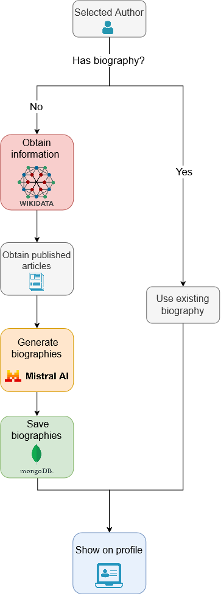
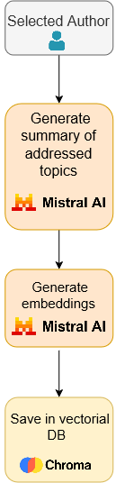
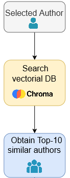
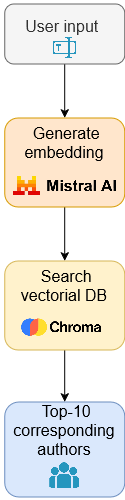
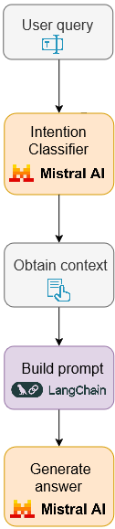

<section align="center">

</section>

Welcome to **Perfil Público**, a powerful platform designed in Python that revolutionizes the way readers discover digital news media authors. Our platform employs a sophisticated framework to analyze and generate author profiles based on their writing style and topics of interest, utilizing a time span of news articles collected from the Arquivo.pt.

## Features

- **Author Profiling**: Our framework automatically generates detailed profiles for news media authors, allowing readers to understand their writing style and preferred topics.
- **Web Platform**: Explore author profiles on our user-friendly web platform, featuring search, recommendation, and filtering functionalities for a seamless and captivating user experience.
- **Scalable Solution**: Leveraging Arquivo.pt for data retrieval and author profile generation, Perfil Público is scalable and easily adaptable to other Portuguese news media outlets. Smaller and region-based news media can integrate our solution effortlessly, eliminating the need for additional local data storage.
- **Conversational Assistant**: A chatbot available on the home and author pages answers questions about authors, topics and articles, using the platform's data and Arquivo.pt as context.

## Demo

Check out our live demo at [Perfil Público Demo](http://www.perfilpublico.pt), showcasing the capabilities of our platform using articles from the Público news outlet.
<section align="center">

</section>

## Methodology

Perfil Público's methodology is divided into two components:

1. **Framework**: Responsible for the automatic generation of authors' profiles based on a time span of news articles from Arquivo.pt.
2. **Web Platform**: Enables readers to discover authors aligning with their preferences through an intuitive and feature-rich web interface.
<section align="center">

</section>

## AI Integration

Four AI-powered features were added on top of the original platform. All of them use Mistral models: `mistral-small-latest` for text generation and `mistral-embed` for embeddings. 

### AI Biography

Authors without a biography get one generated automatically. The pipeline checks whether the author already has a biography, gathers information from Wikipedia/Wikidata (when available) and from the author's articles, and asks the model to write the biography. Generated biographies are shown on the author page with a "Gerado por IA" badge.

Run it with `python -m framework.authorBiography.generate_all_biographies`.

<section align="center">

</section>

### Vectorial DB

The recommendations and the semantic search both rely on a Chroma vectorial database. For each author, the model writes a short summary of the topics they cover, based on their articles. That summary is converted into an embedding and saved in Chroma.

Run it with `python -m framework.recommendationFeatures.generate_all_embeddings`.

<section align="center">

</section>

### Recommendations

The selected author's embedding is used to search the vectorial DB for the 10 most similar authors. These are shown on the author page, alongside the existing metric-based recommendations.

<section align="center">

</section>

### Semantic Search

When a search finds no author by name, the query is converted into an embedding and compared against the author embeddings in the vectorial DB. This lets readers search by subject (e.g. "alterações climáticas") and get the 10 authors who best match it.

<section align="center">

</section>

### Chatbot

A conversational assistant available on the home, author and topic pages. Readers can ask which authors write about a subject, what an author's main topics and articles are, or what an author has said about a given theme.

The chatbot is aware of the page it is on, so a question asked on an author page is understood as being about that author. Answers are grounded in the platform's own data and, for questions about an author's opinions, in article summaries fetched from Arquivo.pt. When the available data does not cover the question, the chatbot says so instead of making up an answer. It replies in European Portuguese and keeps the conversation history, so follow-up questions work.

<section align="center">

</section>

## Getting Started

Follow these steps to get Perfil Público up and running on your local machine:

1. Clone the repository: `git clone https://github.com/nrguimaraes/perfilpublico.git`
2. Install dependencies: `pip install -r requirements.txt`
3. Run the application or framework

## Authors

- **Nuno Ricardo Guimarães** – original Perfil Público project and framework.
- **Ana Francisca Pacheco** – AI-powered features.

Happy reading and exploring with Perfil Público!

